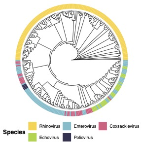

# Brent Allman's Skills Portfolio

Here are some examples of my work. Each section showcases a different skill set of mine, and I have included links to relevant notebooks and repositories.

# Data Wrangling and Visualization



I primarily work in R for data visualization and data processing. Here I show an example of a phylogenetic tree with annotations for various viral species. 

To color the phylogenetic tree with the species names, I had to modify the tree object by matching the accession numbers used to generate the tree with the appropriate species name as determined by the NCBI record fetched using an API call. Downstream, I then modify the tree object to include these data so they can plotted using `ggplot`.
```{r}
library("Biostrings")
s = readDNAStringSet("enterovirus_genus_filtered_align_sorted_unwrapped.fasta")
seq_names = names(s)

seq_names_parsed = c()
i = 1
for (name in seq_names) {
  seq_names_parsed[i] = strsplit(name, split = "/")[[1]][1] #get just the Accession
  i = i+1
}
```

```
library(rentrez)
mycols = c("#313152", "#6abdcd", "#e66283", "#a4d541", "#ffd54a")

seq_species_db = data.frame()
i = 1
for (name in seq_names_parsed) {
  accession = name
  tree_name = seq_names[i]
  species = entrez_summary(db="nucleotide", id=name)$organism
  if (grepl("enterovirus", tolower(species))){
    species_lab = "Enterovirus"
    color = "#6abdcd"
  }else if (grepl("poliovirus", tolower(species))){
    species_lab = "Poliovirus"
    color = "#313152"
  }else if (grepl("coxsackievirus", tolower(species))){
    species_lab = "Coxsackievirus"
    color = "#e66283"
  } else if (grepl("rhinovirus", tolower(species))){
    species_lab = "Rhinovirus"
    color = "#ffd54a"
  }else if (grepl("echovirus", tolower(species))){
    species_lab = "Echovirus"
    color = "#a4d541"
  }else if (grepl("simian agent 5", tolower(species))){
    species_lab = "Enterovirus"
    color = "#6abdcd"
  }else{
    species_lab = "Other"
  }
  seq_species_db = rbind(seq_species_db, data.frame(accession, tree_name, species, species_lab, color))
  i = i+1
}
```
